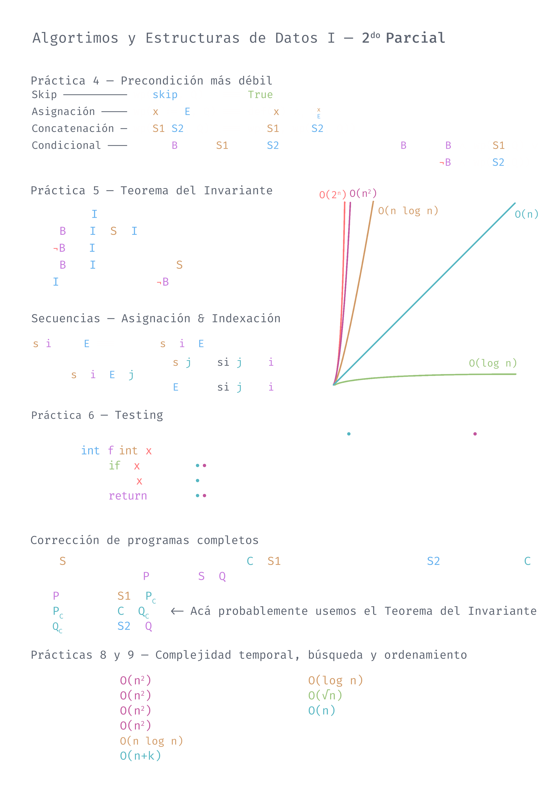

	<h1>Algoritmos y Estructuras de Datos I</h1>
	<h5>COMP930003</h5>

    <table>
        <thead>
            <tr>
                <th colspan="2">Notas</th>
                <th colspan="3">Resumen Segundo Parcial</th>
            </tr>
        </thead>
        <tbody>
            <tr>
                <td><a href='https://github.com/Joan-GQ/exactas/raw/main/COMP930003-AED1/notas/latex/out/main.pdf'>PDF</a></td>
                <td><a href='./notas/latex/'>LaTeX</a></td>
                <td><a href='./assets/aed1-r.png'>PNG</a></td>
		<td><a href='https://raw.githubusercontent.com/Joan-GQ/exactas/main/COMP930003-AED1/notas/resumen/aed1-r.pdf'>PDF</a></td>
            </tr>
        </tbody>
    </table>

